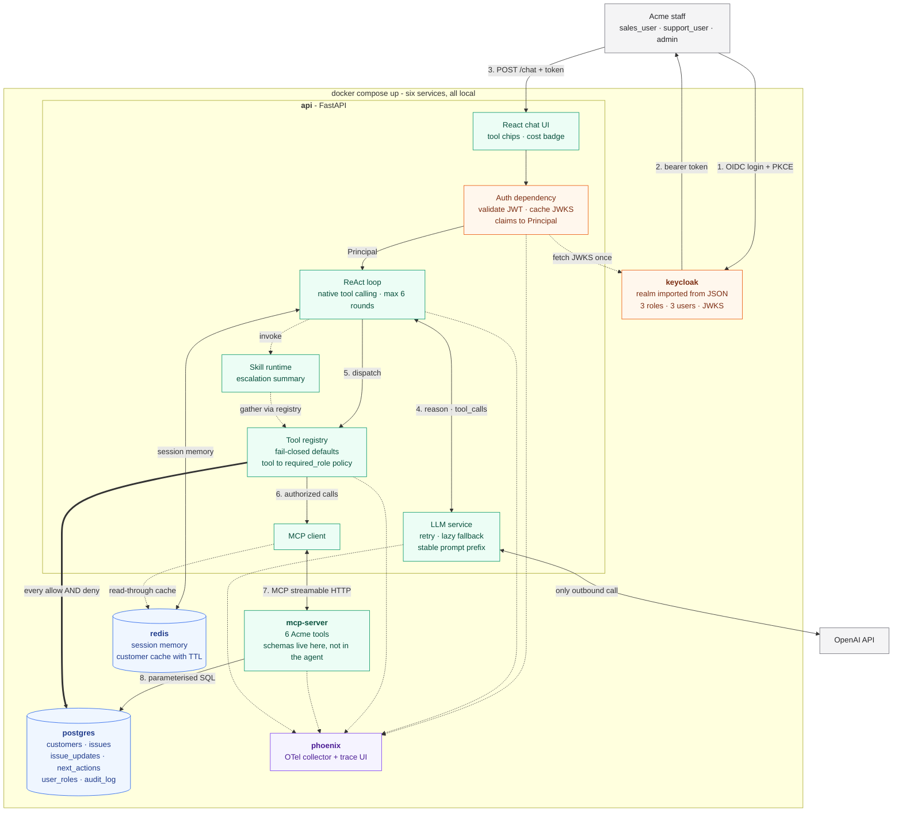
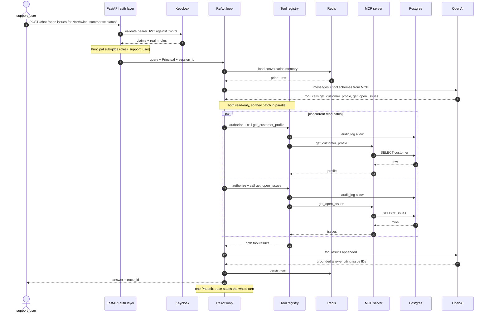
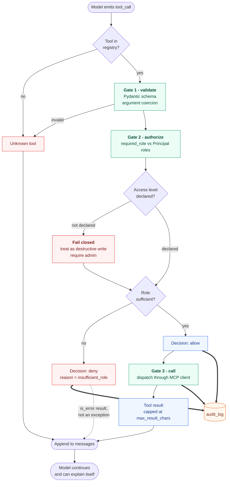
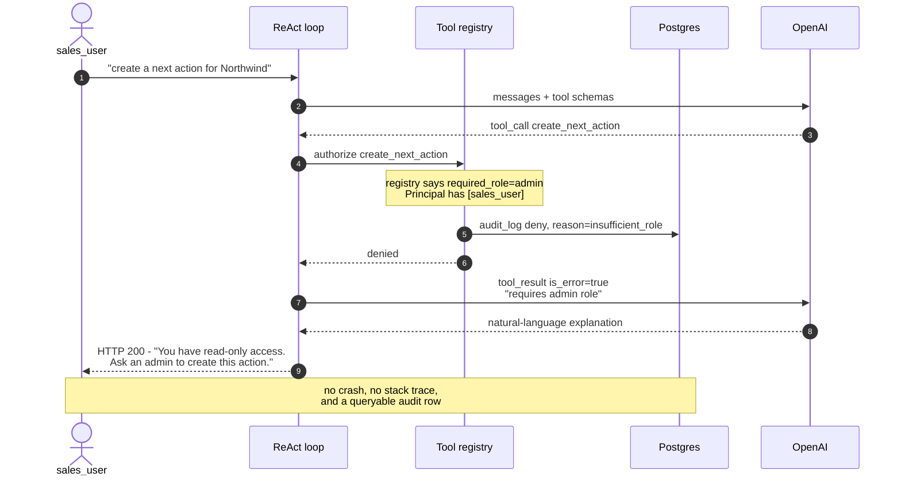

# Architecture - Acme Operations Agentic Assistant

Proposed design for the EY Applied AI Engineer case study. Stack: Python/FastAPI, OpenAI, Docker Compose, Keycloak, PostgreSQL, Redis, MCP, Arize Phoenix.

Four views: system containers, request lifecycle, tool authorization, and the Skill pipeline. Together they cover every component in §4 of the brief.

---

## 1. System containers and data flow

Everything runs locally under `docker compose up`. **The OpenAI call is the only egress** - no other traffic leaves the machine, which is the whole security story in one sentence.

**Reading it:** orange is the trust boundary, green the agent core, blue durable and ephemeral state, purple observability, grey anything outside the machine. Dotted lines are supporting traffic - telemetry, cache reads, key fetches. The thick line to `audit_log` is deliberate: **every authorization decision is written, allow as well as deny.**

Three things a panel will look for: tool schemas live in `mcp-server` and reach the agent only at runtime (§4.2's separation of concerns); nothing touches Postgres except through the MCP server; and the data plane - `postgres`, `redis`, `mcp-server` - **publishes no host ports**, so it is reachable only on the internal Compose network.

---

## 2. Request lifecycle - grounded read with parallel tools

The happy path. Note the two read tools running concurrently, and that Redis is consulted before Postgres.

Returning the `trace_id` to the caller is a small touch that pays off in the demo - paste it into Phoenix and the waterfall for that exact request comes up.

---

## 3. Tool authorization - three gates, fail closed

This is the §4.4 answer, and the diagram to have open during Q&A. The critical edge is the dashed one at the bottom: **a denial is fed back to the model as an error tool result, so the agent explains the refusal instead of the API throwing.**

Worth saying out loud in the walkthrough: RBAC is enforced **here**, at dispatch, not in the system prompt. There is no prompt wording that lets `sales_user` past Gate 2, because the model never gets to run the function.

### The role ladder, one table

The four §4.1 tools alone cannot distinguish `support_user` from `sales_user` - §4.4 gives support **read and update** access to issues, so the registry adds `add_issue_update`. Every cell below is an eval case:

| Tool                              | Access              | sales_user     | support_user   | admin             |
| --------------------------------- | ------------------- | -------------- | -------------- | ----------------- |
| `get_customer_profile`          | read                | allow          | allow          | allow             |
| `get_open_issues`               | read                | allow          | allow          | allow             |
| `summarise_issue_history`       | read                | allow          | allow          | allow             |
| `add_issue_update`              | write: issues       | **deny** | allow          | allow             |
| `create_next_action`            | write: next actions | **deny** | **deny** | allow             |
| `update_next_action`            | write: next actions | **deny** | **deny** | allow             |
| Escalation Skill - persist stage | write: next actions | summary only   | summary only   | summary + persist |

### What that looks like to the user

That HTTP 200 with an explained refusal is the most persuasive thirty seconds of the demo, and the eval set asserts on it.

---

## 4. Customer Escalation Summary Skill

Four stages, so it cannot be mistaken for a single prompt call (§4.3). Only the frontmatter sits in the agent's context; the body loads when the Skill fires.

```mermaid
flowchart LR
    INV(["Agent selects the Skill<br/>matched on when_to_use"]) --> LOAD["Load SKILL.md body<br/>frontmatter was already in context"]

    LOAD --> GATHER

    subgraph GATHER["<b>1 - gather</b> · deterministic, no LLM"]
        direction TB
        T1["get_customer_profile"]
        T2["get_open_issues"]
        T3["summarise_issue_history"]
    end

    GATHER --> REASON["<b>2 - reason</b><br/>single structured-output call"]
    REASON --> VALID{"<b>3 - validate</b><br/>schema conforms?"}

    VALID -->|"no"| RETRY["One repair attempt"]
    RETRY --> VALID

    VALID -->|"yes"| OUT["<b>Output</b><br/>executive_summary<br/>risk_level enum<br/>recommended_next_action<br/>missing_information[]"]

    OUT --> PERSIST{"<b>4 - persist</b><br/>caller is admin?"}
    PERSIST -->|"yes"| WRITE[("next_actions<br/>+ audit_log")]
    PERSIST -->|"no"| RETURN(["Return summary only"])
    WRITE --> RETURN

    classDef step fill:#ecfdf5,stroke:#059669,color:#064e3b
    classDef out fill:#eff6ff,stroke:#2563eb,color:#1e3a8a
    classDef store fill:#fff7ed,stroke:#ea580c,color:#7c2d12

    class GATHER,REASON,RETRY step
    class OUT out
    class WRITE store
```

Stage 1 is deterministic and therefore unit-testable with the tools stubbed. Stage 4 reuses the same registry gate as any other write - the Skill gets no privilege the caller doesn't have, which is a question worth pre-empting.

---

## Component map

| Brief                      | Where it lives                               | Notes                                                                                                         |
| -------------------------- | -------------------------------------------- | ------------------------------------------------------------------------------------------------------------- |
| §4.1 Agent + tools        | `api` ReAct loop, `mcp-server`           | Four required tools + `add_issue_update` + `update_next_action` (covers every §4.4 capability); dynamic selection, no keyword routing |
| §4.2 MCP                  | `mcp-server` container                     | Separate process; schemas discovered at runtime                                                               |
| §4.3 Skill                | `skills/customer_escalation_summary/`      | Versioned, four stages, schema-validated                                                                      |
| §4.4 Keycloak + RBAC      | `keycloak`, auth dependency, tool registry | Realm as committed JSON; enforcement at dispatch                                                              |
| §4.5 Compose              | `docker-compose.yml`                       | Six services, health checks, one command                                                                      |
| §4.6 Postgres             | `postgres`                                 | Six tables - the five required plus`audit_log`                                                             |
| §4.7 Redis                | `redis`                                    | Session memory and lookup cache, distinct jobs                                                                |
| §4.8 Eval + observability | `phoenix`, OTel spans, `make eval`       | Trace-derived tool assertions, not self-reported                                                              |

## Security posture - five sentences for Q&A

1. **Identity**: Keycloak via OIDC auth-code + PKCE on the chat page, or a plain bearer token on the API; JWTs verified against JWKS on every request, nothing session-side to steal.
2. **Authorization**: enforced at tool dispatch with fail-closed defaults - an unannotated tool requires `admin`, and no prompt wording reaches past Gate 2.
3. **Blast radius**: the data plane publishes no host ports, the OpenAI call is the only egress, and SQL is parameterised and issued only by the MCP server.
4. **Injected content is contained**: issue text is user-generated and enters the model's context, so the seed data includes a live prompt-injection attempt - the eval proves the agent can be *persuaded* but not *authorized*; the write is denied and the attempt lands in `audit_log`.
5. **Everything is auditable**: every allow and deny is a queryable row - actor, role, tool, args, decision, reason.

## Trade-offs visible in these diagrams

- **MCP over Streamable HTTP, not stdio.** The server is a separate container, so stdio would couple the processes; Streamable HTTP is the current MCP remote transport (the older HTTP+SSE transport is deprecated). Costs a network hop, buys genuine deployability.
- **All Postgres access via MCP.** The API never opens its own connection to business tables. One chokepoint to audit; slightly more indirection.
- **`audit_log` is not in the brief.** §3.1 asks for an auditable experience and §4.6 never requires the table. A few hours, and it answers most enterprise-readiness questions on its own.
- **A polished React UI, though the brief doesn't ask for one.** §3.2 permits "a simple UI or API" - but the panel watches the UI for 15 minutes, and an FDE's craft shows there. It stays a static build served by FastAPI (no extra runtime container), and it exists to make the architecture visible: tool-call chips with allow/deny badges, per-turn cost and latency, a trace link into Phoenix.
- **Redis is not the source of truth.** It holds conversation state and cached reads only; anything a next action depends on is re-read from Postgres before a write.
